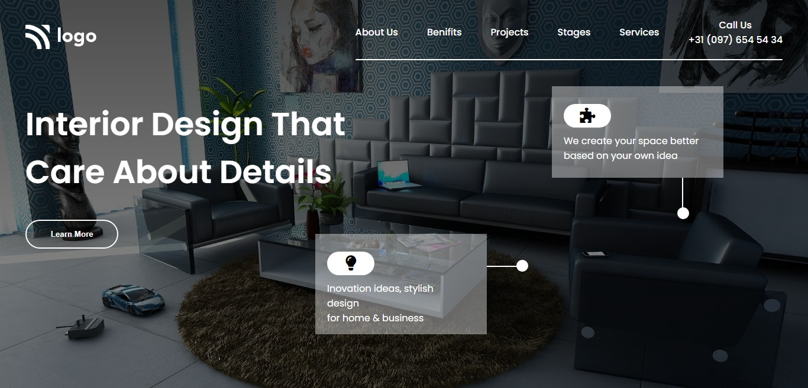

# Project 10 - Interior Design Landing Page

  

 

[DEPLOYED WEBSITE LINK](https://fsbproject10.netlify.app/)

## What I learned from this Project?

- I learned to use background-image with lienar-gradient.

## Completed the project in **1 hour 30 minutes**.